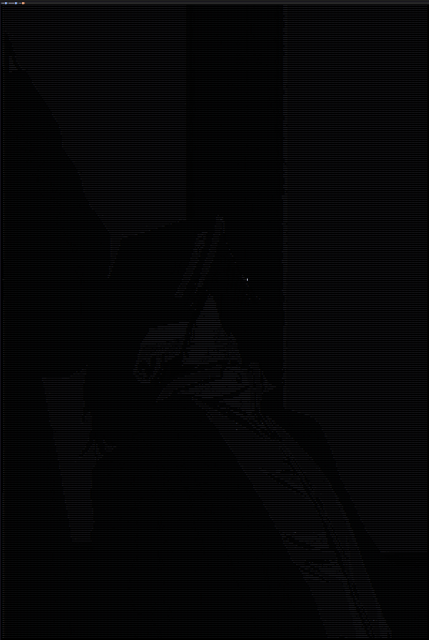

# toAscii
toAscii is a very basic image to ascii converter using OpenCV and barebones simple project done in 2hrs just to get some practice with c++.

If your on a linux system you can probably download the [toAscii](toAscii) file and run it.

After the program is done with execution, it will open [result.txt](result.txt) file with you Ascii image in it.You will want to decrease the font size ;)

